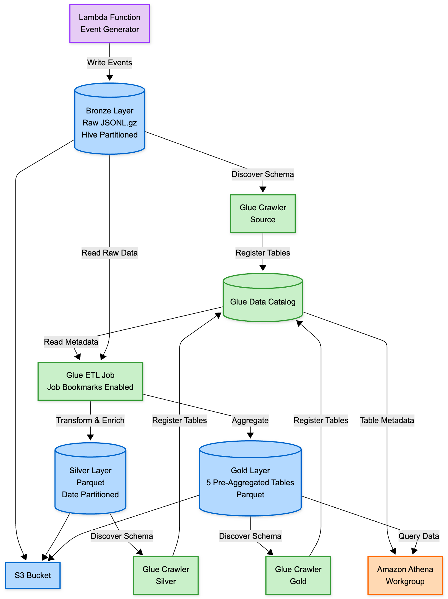
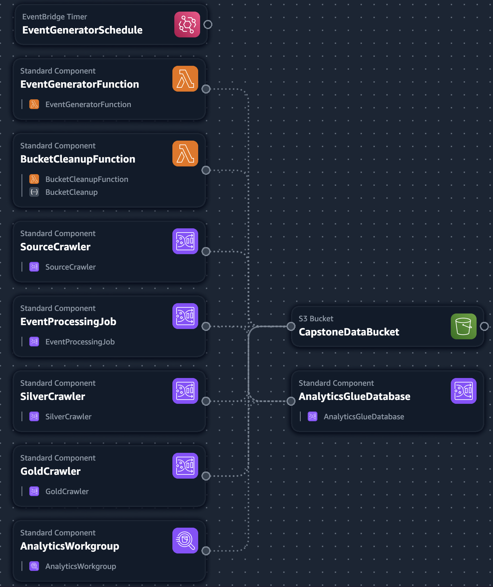

Richard Pallangyo
UW—MSDS
DATA 516, Autumn 2025
Professor Mark Kazzaz

# Designing an E-commerce Analytics Data Pipeline

## Introduction

In this project, I serve as a data engineer at an e-commerce company where a product analytics team logs user events. Still, data scientists struggle to query the raw logs effectively. My goal is to build a production-grade analytics pipeline that converts raw events into a reliable, high-performance dataset for data scientists to use in experiments and analysis.

The company generates between 500,000 and 750,000 events every five minutes—page views, cart additions, purchases, and search queries—all stored as compressed JSONL files. While raw data capture is reliable, querying these files directly requires scanning hundreds of megabytes for even simple analyses. The analytical dataset must enable the data scientists, and more importantly, the business, to understand the following:

  * **Conversion Funnel:** Calculate view—add-to-cart—purchase conversion rates for each product.
  * **Hourly Revenue:** Calculate total revenue per hour (price × quantity for each purchase).
  * **Top 10 Products:** Query and view the top-performing products based on user views.
  * **Category Performance:** View all event types (views, cart additions, purchases) and their total counts grouped by category.
  * **User Activity:** View the number of unique users and sessions per day.

These business requirements directly inform the technical specifications. New data arrives every five minutes, so the pipeline must handle incremental data without reprocessing everything each time. The solution needs to be production-ready—reliable enough to handle failures gracefully, performant enough to support interactive analysis, cost-efficient, and maintainable through infrastructure as code. My architectural decisions—data formats, processing strategies, and query optimization techniques—will determine whether the data science team can iterate quickly on experiments or remain blocked by slow, expensive queries.

## Data Design Architecture

I designed the pipeline using a three-layer (bronze, silver, and gold) medallion architecture—a data design pattern that separates raw data ingestion, business-logic transformations, and analytics-optimized outputs. This approach offers clear data lineage, allows reprocessing data when business logic changes, and improves query performance through progressive refinement.



### Bronze Layer: Immutable Source of Truth

This layer stores the raw events exactly as the Lambda function generates them. The events are stored in an S3 bucket as compressed JSONL files partitioned using Hive-style directory structure: `year=YYYY/month=MM/day=DD/hour=HH/minute=mm`. I configured an AWS Glue crawler to automatically discover the schema and register the table in the Glue Data Catalog. This layer serves as the permanent source of truth. If I ever need to change the transformation logic, I can always reprocess the data from the Bronze-level without losing the original data.

### Silver Layer: Cleaned and Enriched Data

The Silver layer applies business-logic transformations using an AWS Glue job with the PySpark engine. For instance, I parse ISO 8601 timestamp strings into proper datetime objects and calculate revenue as price times quantity for purchase events. Also, while the Lambda function generates clean data with no nulls in the critical fields, I included a defensive data quality check to filter out records missing a timestamp, user ID, session ID, or even the type. This mechanism, although it may not apply here, is a best practice for production data pipelines because it ensures the pipeline remains robust even if the upstream data source changes in the future. The output is then stored as Parquet files with Snappy compression, partitioned by data dimensions. Storing the data files in Parquet format allows taking advantage of Parquet’s columnar format, which is essential for query performance. The format enables Athena to use predicate pushdown and column pruning. For example, if a query only needs the product ID, Athena scans just that one column instead of reading entire rows. This not only significantly reduces query latency but also reduces query costs.

### Gold Layer: Pre-Aggregated Analytics Tables

Here we store the transformed data, ready to answer the five business questions. The layer contains five pre-aggregated tables in an S3 bucket, each optimized for a required business query. The tables are `product_funnel` for conversion rates, `category_daily_performance` for category metrics, `daily_user_activity` for user engagement, `hourly_revenue` for hourly revenue, and `product_popularity` for top products. The tables are tiny in size–measured in kilobytes rather than megabytes–because they store only aggregated results needed to understand the five business questions rather than the raw events. Pre-aggregation trades ETL complexity for massive gains in query performance. Instead of scanning millions of events and computing aggregations at query time, data scientists query pre-computed results directly.

## Tool Selection and Design Decisions

When designing this pipeline, I prioritized managed services to minimize operational overhead while staying within AWS student account limits.

### AWS Glue for ETL

I chose AWS Glue over self-managed EMR because (1) Glue’s serverless model meant I did not need to provision or manage clusters—I simply specified two Data Processing Units (DPUs) and let AWS handle the infrastructure, (2) Glue’s job bookmarks feature provided built-in incremental processing without custom state management—Job bookmarks track which files have been processed by storing metadata about S3 file paths and modification times, allowing subsequent runs to process only new data, (3) while EMR offers more control and potentially lower costs at scale, Glue’s simplicity and automatic scaling made it ideal for this project with variable workloads, (4) managing your own clusters means you have to pay for them while they run, and you may forget to turn them off when not in use—using AWS Glue removes this concern.

### Athena for Querying

Athena’s serverless, pay-per-query model perfectly aligns with the need for cost-effective, interactive analysis. Unlike Redshift, which requires a continuously running cluster (“Redshift provisioned starts at $0.543 per hour, while Redshift Serverless begins at $1.50 per hour”), Athena charges only for data scanned ($5 per TB). Therefore, for a data science team that might run queries sporadically, this means zero idle costs. Moreover, Athena’s out-of-the-box integration with Glue Data Catalog also eliminates the need for separate schema management—tables cataloged by Glue crawlers are immediately queryable in Athena.

### Parquet with Snappy Compression

As hinted above, converting the JSONL data to Parquet in the silver layer was necessary to improve query performance. Parquet columnar format enables Athena to filter at the storage layer and read only the required columns. For example, suppose our query requires only the product ID and revenue from a specific date dimension(s). In that case, Athena scans only the two columns and the data in the specified date dimension, rather than the entire rows and the S3 bucket. Snappy compression provides a good balance between compression and decompression speed, which is vital for the interactive queries run by the data scientists.

### Medallion Architecture

The three-layer design approach builds maintainable data pipelines and cleanly separates concerns—Bronze preserves raw data for reprocessing, Silver applies business logic transformations, and Gold optimizes for specific queries. This pattern worked well for this pipeline and scales to production workloads because it balances flexibility with performance: you can reprocess data from Bronze if the logic changes and query the Gold layer for speed.

### Pre-Aggregation Strategy

Creating five Gold tables increased ETL complexity but greatly improved query performance. By computing aggregations once during ETL instead of repeatedly at query time, I reduced query latency by 16.6x when testing with 4-5 hours of data generation. The trade-off was acceptable because the five business questions were clear and stable. This approach follows the principle of "write once, read many"—using more compute during ETL to save significantly more during queries.

### PySpark ETL Script vs. Visual ETL or Separate Jobs

I built the entire medallion pipeline in a single PySpark script, rather than using AWS Glue Visual ETL or separate jobs for each layer. This method gave me complete programmatic control over complex transformations—such as calculating revenue, parsing timestamps, and creating five unique Gold aggregations—that would be difficult in a visual interface. Running all three layers in a single job also ensures atomic execution: either the whole Bronze-Silver-Gold pipeline succeeds, or none of it does, preventing inconsistent states across layers. Plus, having all transformation logic in a single versioned script enables proper code review, testing, and deployment via infrastructure as code rather than clicking through a visual interface. The final script is under 350 lines and handles all three layers in a single atomic job.

### Infrastructure as Code

I defined the entire pipeline in CloudFormation templates and PySpark scripts ensures the infrastructure is reproducible—a teammate can deploy the same resources with a single command rather than manually clicking through the AWS console. This method also supports version control: every change to the pipeline is recorded in Git, enabling rollbacks to previous working states and providing a clear audit trail of what was altered, when, and why.



## Challenges

While testing, I encountered a couple of issues. First, when I was testing incremental data processing, I needed to handle the case where job bookmarks filter out all files because they have already been processed.  The Glue Job would fail with an error like “Column ‘timestamp’ does not exist when trying to filter or parse non-existent data and mark the job as FAILED.  To address this issue, I restructured the script to check for empty Dataframes early and wrap all processing logic in an else block. This pattern ensures the job completes successfully, whether it processes zero records or 26 million records (I tested), which is important for automated scheduling. The key insight is that Glue expects `job.commit()` to always run—it's the signal that the job completed successfully, regardless of how much data was processed. Second,
Bronze queries initially failed because the Lambda generates ISO 8601 timestamps with timezone offsets (`2025-12-07T03:55:56.633003+00:00`), which Athena's standard `CAST(... AS TIMESTAMP)` doesn't handle. I used `FROM_ISO8601_TIMESTAMP()` instead, which correctly parses the full ISO 8601 format, including time zone information. This allowed Bronze queries to work without modifying the source data format. In the Silver layer ETL, I used PySpark's `to_timestamp()` function to convert these strings to proper timestamp objects for efficient date-based filtering and partitioning.

## Validation of Query Performance, Incremental Processing, and Storage Optimization with a Sample Pipeline Run

After I had generated about 4-5 hours of data, I validated the pipeline's performance by comparing query execution times and costs between the Bronze layer (raw events) and Gold layer (pre-aggregated tables).


### Query Performance Comparison

| Query | Bronze Runtime | Gold Runtime | Speedup | Data Scanned (Bronze) | Data Scanned (Gold) | Scan Reduction |
| :--- | :--- | :--- | :--- | :--- | :--- | :--- |
| Product Conversion Funnel | 5.43s | 0.48s | 11.3x | 419.69 MB | 3.98 KB | 105,448x |
| Hourly Revenue Trends | 8.47s | 0.78s | 10.9x | 419.69 MB | 0.82 KB | 511,817x |
| Top 10 Products | 8.93s | 0.55s | 16.2x | 419.69 MB | 2.64 KB | 158,974x |
| Category Performance | 13.04s | 0.89s | 14.7x | 419.69 MB | 2.02 KB | 207,767x |
| User Activity | 18.59s | 0.62s | 30.0x | 419.69 MB | 0.39 KB | 1,076,128x |
| **Average** | **10.9s** | **0.66s** | **16.6x** | **419.69 MB** | **2.0 KB** | **412,027x** |

Gold queries averaged 0.66 seconds compared to 10.9 seconds for Bronze queries—a 16.6x speedup. Pre-aggregation reduced the amount of data scanned by an average of 412,027x, directly translating into cost savings. At Athena's $5 per TB pricing, Bronze queries cost $0.0021 each while Gold queries cost essentially nothing for this sample test.  Beyond performance, Gold tables drastically simplified query complexity. Bronze queries required complex SQL with CASE statements, ISO 8601 timestamp parsing (`FROM_ISO8601_TIMESTAMP`), and multiple GROUP BY clauses. Gold queries are simple SELECT statements:

```sql
-- Bronze: Complex
SELECT DATE(FROM_ISO8601_TIMESTAMP(timestamp)) AS event_date,
       COUNT(DISTINCT user_id) AS unique_users
FROM events
GROUP BY DATE(FROM_ISO8601_TIMESTAMP(timestamp));

-- Gold: Simple
SELECT * FROM daily_user_activity ORDER BY event_date DESC;
```

This simplicity I built lets data scientists focus on analysis rather than SQL engineering while reducing the risk of query errors.

### Incremental Loading

To validate that incremental loading was working, I ran the ETL job three times to validate job bookmarks:

1.  **First run (Day 05 data):** 13m 47s, processed 154 MB
2.  **Second run (no new data):** 59s, gracefully exited
3.  **Third run (Day 07 data):** 24m, processed 265 MB

The 59-second runtime with no new data present proves that job bookmarks correctly track processed files at the partition level—the pipeline only processes new data, avoiding expensive reprocessing of historical data.

### Storage Optimization

The medallion architecture achieved a 14,779x reduction in storage from Bronze (440 MB, 25.9M rows) to Gold (29 KB, 129 rows) while retaining all necessary information to answer the five business questions.

## Deployment Instructions

For step-by-step instructions on deployment and testing, refer to the [README.md].

## Conclusion

This project allowed me to apply the core principles I learned in DATA 516 Scalable Data Systems and Algorithms to a real-world analytics pipeline. The course emphasized designing systems that balance performance, cost, and scalability—principles I implemented through the medallion architecture's separation of raw ingestion (Bronze), business logic (Silver), and query-optimized aggregations (Gold). The decision to use Parquet's columnar format directly applied course concepts of predicate pushdown and column pruning, where Athena scans only the required columns rather than entire rows. This optimization, combined with the partitioning strategies we studied to reduce the amount of data scanned, resulted in a 412,027x cost reduction. Similarly, implementing job bookmarks for incremental processing demonstrated the "process only what's new" pattern we learned for handling streaming or batch data at scale.

The course's focus on trade-offs guided my architectural decisions: pre-aggregation trades ETL complexity and compute cost for significantly improved query performance—a "write once, read many" optimization. Choosing serverless services (Glue, Athena) over managed clusters (EMR, Redshift) aligned with the principle of minimizing operational overhead while maintaining elasticity for variable workloads. Most importantly, this project reinforced that scalable systems are not just about handling large data volumes—they're about making the right architectural choices so performance and costs remain predictable as data grows. By applying course principles—columnar storage, partitioning, incremental processing, and pre-aggregation—I built a pipeline that processes events incrementally and delivers sub-second queries while remaining cost-effective for production deployment. I validated this by processing 25.9 million events in my test.